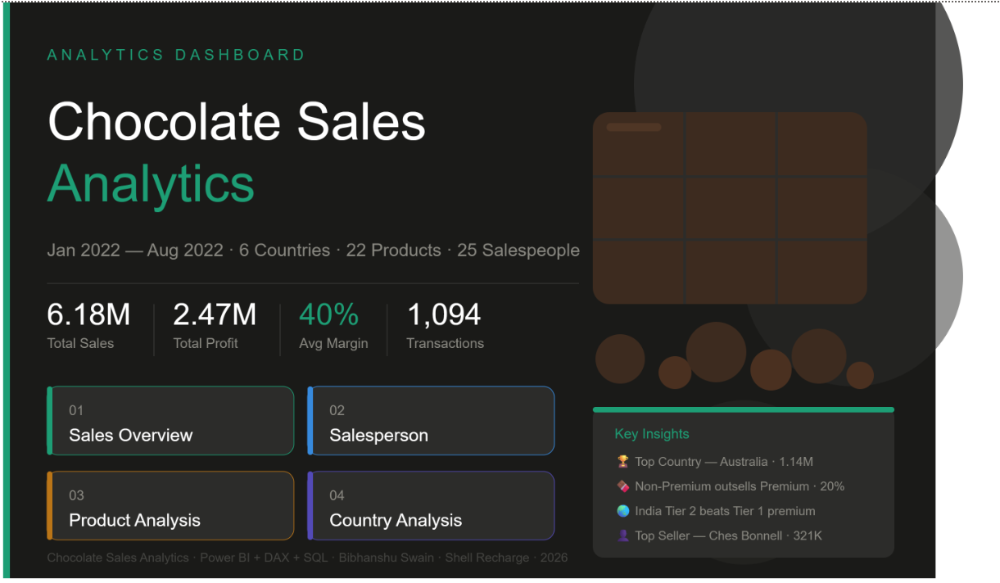
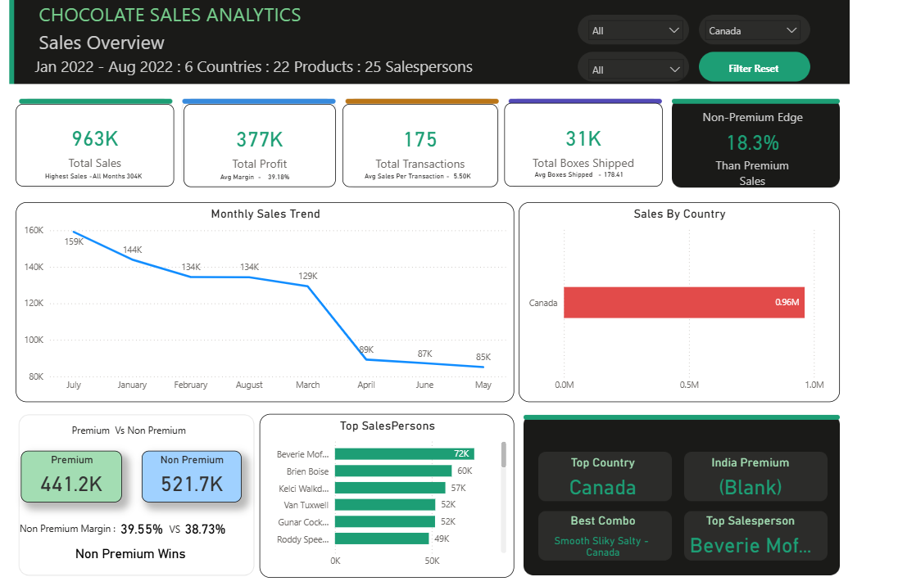
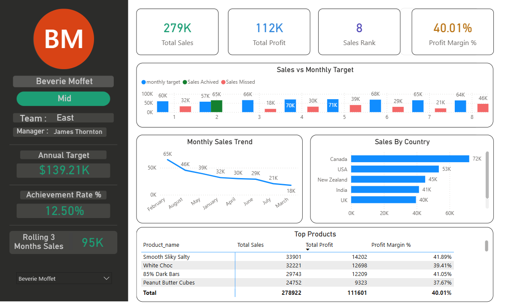
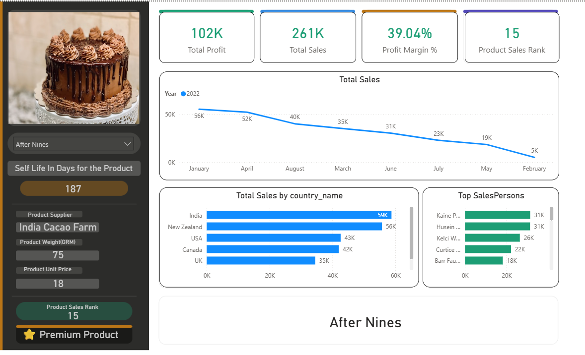
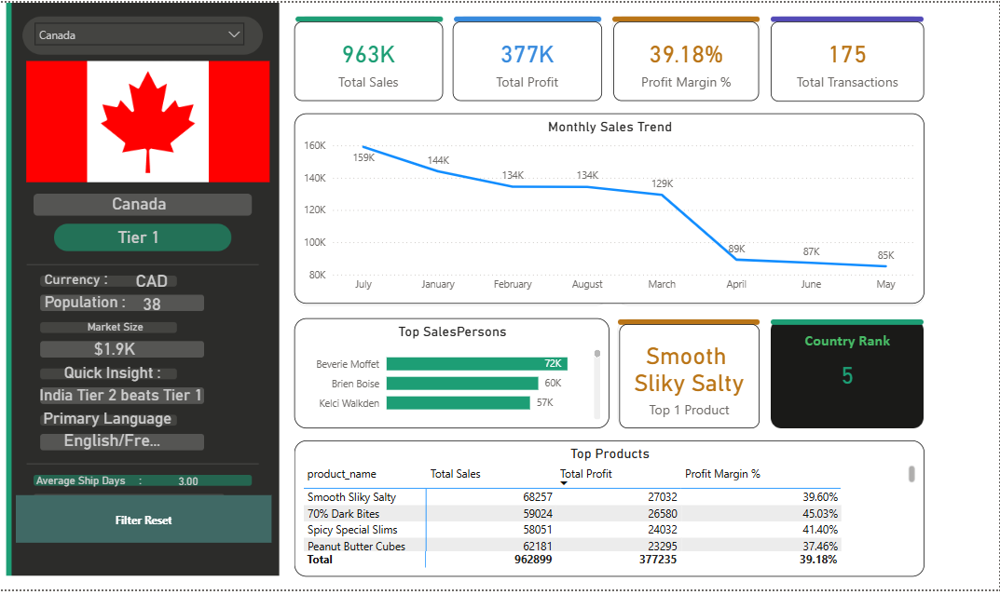

# 🍫 Chocolate Sales Analytics — Power BI + SQL + ML

> An end-to-end business intelligence project combining SQL Server data engineering, advanced Power BI dashboards with DAX, and Machine Learning — built on a synthetic chocolate sales dataset modeled as a star schema.

---

## 📌 Problem Statement

> *"Analyze chocolate sales data across 6 countries, 22 products and 25 salespersons for Jan–Aug 2022. Build an interactive Power BI dashboard to uncover sales trends, salesperson performance, product profitability and country-level market insights — supported by SQL analysis and ML experimentation."*

---

## 🖥️ Dashboard Preview

### 🏠 Welcome Page


### 📊 Sales Overview


### 👤 Salesperson Performance


### 🍫 Product Analysis


### 🌍 Country Analysis


---

## 🗂️ Project Structure

```
Chocolate-Sales-BI-ML/
│
├── sql/
│   ├── 01_exploration.sql          # Data exploration queries
│   ├── 02_joins.sql                # Multi-table JOIN analysis
│   └── 03_target_analysis.sql      # Target vs Actual analysis
│
├── Chocolate_Dax.pbix              # Power BI dashboard (5 pages)
├── Data to SQL.py                  # Data loader — Excel → SQL Server
├── ML_Chocolate.py                 # ML experiments on enriched dataset
├── ML_Chocolate_Working.py         # Working ML model (R² 0.94)
└── README.md
```

---

## 🏗️ Architecture — Star Schema

```
Dim_Salesperson ──┐
Dim_Product     ──┤── Fact_Sales ──── Monthly_Targets
Dim_Country     ──┘
Dim_Date (DAX)
```

| Table | Rows | Description |
|---|---|---|
| `Fact_Sales` | 1,094 | Core transactions |
| `Dim_Salesperson` | 25 | Team, experience, targets |
| `Dim_Product` | 22 | Category, price, premium flag |
| `Dim_Country` | 6 | Tier, currency, market size |
| `Monthly_Targets` | 1,800 | Monthly targets per person per country |

---

## 🧹 SQL Analysis

All exploration and analysis done in **SQL Server** before Power BI:

### Key queries written:
- Multi-table JOINs across star schema
- Window functions for ranking and aggregation
- Target vs Actual analysis with 4-level CTEs
- Achievement rate calculation per salesperson
- Premium vs Non-Premium segmentation

### SQL Findings:

| # | Finding | Detail |
|---|---|---|
| 1 | Top Country | Australia — 1.14M sales |
| 2 | Top Salesperson | Ches Bonnell — 321K |
| 3 | Best Product | White Choc — 138K profit |
| 4 | Non-Premium wins | Outsells premium by 20% with higher margin (40.74% vs 39.20%) |
| 5 | India surprise | Tier 2 market beats ALL Tier 1 in premium spending — 517K |
| 6 | Best combo | 50% Dark Bites in Australia — 36,707 profit |
| 7 | Feb insight | Highest avg sale per transaction — 6,358 |
| 8 | Best achiever | Beverie Moffet — 12.5% target achievement rate |

---

## 📊 Power BI Dashboard — 5 Pages

Built with advanced DAX, dynamic visuals and LinkedIn-style profile cards:

### Page 1 — Welcome Page
- Static beautiful landing page with navigation buttons
- Key stats — 6.18M sales, 2.47M profit, 40% margin
- 4 clickable navigation cards to all pages

### Page 2 — Sales Overview
- Dark header with 3 slicers + filter reset
- 5 KPI cards with sub-labels and colored top borders
- Monthly sales trend line chart
- **Dynamic green/red country coloring** — countries above/below average
- Premium vs Non-Premium comparison with dynamic winner card
- Top Salespersons bar chart
- Dark insights panel — Top Country, India Premium, Best Combo, Top Salesperson

### Page 3 — Salesperson Performance
- **LinkedIn-style profile card** — dynamic avatar with initials
- Salesperson name, experience badge, team, manager
- Annual target, achievement rate %, rolling 3-month sales
- Sales vs Monthly Target — **green = achieved, red = missed**
- Monthly trend + Sales by Country + Top Products table

### Page 4 — Product Analysis
- Dynamic product image changes with selection
- Product details — category, supplier, weight, unit price, shelf life
- Premium/Standard badge + Product Sales Rank
- Sales by Country + Monthly trend + Top Salespersons

### Page 5 — Country Analysis
- **Dynamic country flag** changes with selection
- Country profile — tier badge, currency, population, market size
- 4 KPI cards + Monthly trend
- Top Salespersons + Top Products table
- Dynamic Country Rank card

---

## 🎯 Key DAX Measures

| Measure | Purpose |
|---|---|
| `[Total Sales]` | SUM of amount |
| `[Profit Margin %]` | DIVIDE(profit, sales) |
| `[Country Color]` | Dynamic green/red using AVERAGEX |
| `[Achievement Rate %]` | COUNTROWS of achieved months / total |
| `[Monthly Target]` | CALCULATE with FILTER by person + month |
| `[Sales Achieved]` | IF(Sales >= Target, Sales, BLANK()) |
| `[Non Premium Edge]` | % more non-premium outsells premium |
| `[Top Combo]` | SUMMARIZE + TOPN + CONCATENATEX |
| `[Prem Vs Non Prem Winner]` | SWITCH(TRUE()) — dynamic insight |
| `[Selected Country Flag]` | SELECTEDVALUE with HASONEVALUE guard |

---

## 🤖 Machine Learning

### Experiment 1 — Enriched Dataset (this repo)

Attempted regression on joined star schema data (1,094 rows × 26 features):

| Model | R² | RMSE | Verdict |
|---|---|---|---|
| Linear Regression | -0.06 | ~4,500 | ❌ Failed |
| Random Forest | -0.08 | ~4,500 | ❌ Failed |
| Gradient Boosting | -0.29 | 4,973 | ❌ Worst |

**Root cause:** Sales amount was synthetically generated randomly — no real correlation with features. All models failed because there are no learnable patterns. This is a data quality issue not a model issue.

> *"Garbage in = Garbage out — even XGBoost can't learn from random noise!"*

---

### Experiment 2 — Working Model ✅ (separate repo)

On the original simple chocolate dataset with real mathematical relationships:

| Model | R² | RMSE |
|---|---|---|
| Linear Regression | 0.84 | 1,571 |
| **Random Forest** | **0.94** | **947** ✅ Winner! |
| Gradient Boosting | 0.93 | 1,013 |

**Key finding:** `Boxes shipped` drove 73-80% of prediction — direct mathematical relationship with Amount.

👉 **[See working ML model here](https://github.com/bibhanshu/Sales-Amount-Prediction-using-Machine-Learning-Models)**

---

## 💡 Key Learnings

1. **Star schema design** enables powerful cross-dimensional analysis
2. **Dynamic conditional formatting** with AVERAGEX — advanced DAX pattern
3. **Data quality > Model complexity** — synthetic data kills all models
4. **Non-Premium outsells Premium** with higher margin — counterintuitive insight!
5. **India (Tier 2) beats Tier 1** in premium spending — strategic opportunity
6. **LinkedIn-style profile cards** in Power BI — unique portfolio differentiator
7. **SQL verification** before trusting Power BI numbers — professional habit

---

## 🚀 How to Run

### Prerequisites:
```
pip install pandas sqlalchemy pyodbc openpyxl scikit-learn
```

### Step 1 — Load data to SQL Server:
```
python "Data to SQL.py"
```

### Step 2 — Open Power BI:
```
Open Chocolate_Dax.pbix in Power BI Desktop
Refresh data source → point to your SQL Server
```

### Step 3 — Run ML experiments:
```
python ML_Chocolate.py           # enriched dataset experiment
python ML_Chocolate_Working.py   # working reference model
```

---

## 🛠️ Tech Stack

| Layer | Technology |
|---|---|
| Database | Microsoft SQL Server |
| Data Loading | Python · SQLAlchemy · pyodbc |
| BI Dashboard | Power BI Desktop |
| DAX | 20+ custom measures |
| ML | Scikit-learn · Python |
| Version Control | Git · GitHub |

---

## 👤 Author

**Bibhanshu Swain**
Technical Recruiter & HR Data Analyst · Shell Recharge
SQL · Power BI · DAX · Python · Machine Learning

🔗 [GitHub](https://github.com/bibhanshu) · [LinkedIn](https://www.linkedin.com/in/bivansu-swain-401634166/)

---

⚠️ *This project uses synthetic data generated for learning purposes. All sales figures and employee data are fictional.*
